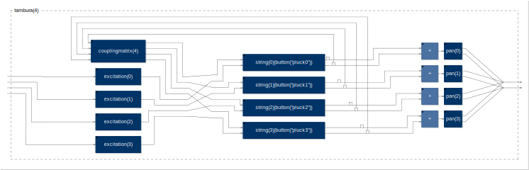

#Tambura.dsp - Waveguide physical model of an Indian Tambura/Tanpura

This is a FAUST patch inspired by the Indian [Tambura/Tanpura](https://en.wikipedia.org/wiki/Tanpura) - a four string drone instrument, known for its unique rich harmonic timbre.

The model uses a few tricks to produce a Tambura-like sound, and should probably be referred to as a "pseudo" physical model, because it does not attempt to accurately recreate the physics of the string-bridge interaction. It includes a range of parameters selected to allow control of the qualities of the excitation/pluck, string behaviour and sympathetic resonance. It can produce some beautiful evolving drones, which can vary from very synthetic to quite natural.

Although it was originally developed as a Max4Live device using faustgen~, this version is entirely written in FAUST. Some aspects of the model still sound a little better in the Max4Live version and the FAUST version is missing convolution of the Body IR which is fundamental to the realism of the model. 

This has been an ongoing hobby project since 2013.

**Getting started:**

Compile the FAUST .dsp file to your favorite platform/architecture, or [try it on the web](http://olilarkin.co.uk/tambura/).

http://olilarkin.co.uk/tambura/

**Audio Examples**

Audio Examples from the Max4Live version can be found here:

https://soundcloud.com/olilarkin/sets/tambura-model

**References:**

* https://en.wikipedia.org/wiki/Tanpura
* http://www.ee.columbia.edu/~marios/projects/risset_beats/risset_beats.html
* http://csoundjournal.com/issue17/bain_risset_arpeggio.html
* http://users.spa.aalto.fi/vpv/publications/cmj98.pdf
* https://ccrma.stanford.edu/~rmichon/publications/doc/DAFx11-Nonl-Allpass.pdf

**Credits:**

Written by Oliver Larkin  
Thanks to Yann Orlarey, JOS.

License: GPL  
www.olilarkin.co.uk